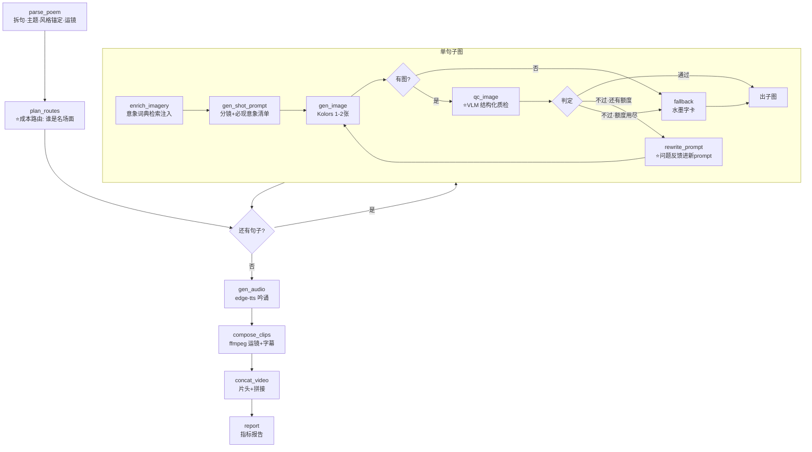

# 诗境(参考实现)—— 古诗词视频全自动生产 Agent

输入一首绝句,输出带吟诵、字幕、配画、运镜的竖版成片。
对应《Agent开发执行手册》项目一的 **M1-M4**(LangGraph 编排 / 意象 RAG / 质检反思环 / 成本路由),不含 M5 服务化。

> ⚠ **给未来的你:先别读代码!**
> 这是 Claude 写的参考实现。正确用法:
> 1. 7/27 起你先自己写 `design.md`(状态图、State 字段、工具清单)
> 2. 自己把 M0-M4 搓出来
> 3. **然后**回来逐模块 diff,把差异记下来——"我看过一版参考实现,重做时我改了 X 因为 Y" 本身就是面试素材
> 提前抄 = 这版存在的意义归零。

## 运行

```powershell
conda activate poem-agent
cd f:\desktop\Poem\poem_agent
python main.py "床前明月光,疑是地上霜。举头望明月,低头思故乡。" --title 静夜思 --author 李白
```

- key 管理:复用上层 `f:\desktop\Poem\.env`。只有 `DEEPSEEK_API_KEY` 时跑**降级模式**(画面=水墨字卡,质检模拟);加上 `SILICONFLOW_API_KEY` 后自动切**真实模式**(Kolors 生图 + Qwen-VL 质检)
- 中途 Ctrl+C 后原命令重跑 = 从断点续传;`--fresh` 强制从头
- 产物在 `output/<诗名>_<hash>/`:`final.mp4` 成片 + `run_report.md` 评估报告

## 状态图



**"哪个箭头是 agent 在做决策?"**(手册 Day 19-21 过关问题)
→ `plan_routes` 的 standard/premium 分配、`qc_image` 后的三岔口。其余是固定管线。这就是"为什么它是 agent 不是 pipeline"的答案:处理路径由模型根据中间结果动态决定。

## 与手册里程碑对照

| 手册 | 本仓库落点 |
|---|---|
| M1 编排主图 + checkpoint | `graph.py` 主图游标循环;`main.py` SqliteSaver 续传 |
| M2 意象 RAG | `tools/imagery_rag.py` + `data/imagery_dict.json`(48 词条,防"现代床"看`床`词条) |
| M3 质检反思环 ⭐ | 子图 `qc_image → rewrite_prompt → gen_image` 闭环;`tools/vlm_qc.py` 结构化判据 |
| M4 成本路由 | `plan_routes` 节点 + premium 多候选选优;预算保险丝在 `process_line` |
| M6 指标雏形 | `report` 节点 → `run_report.md`(一次通过率/平均重试/成本/耗时) |

## 面试考点在代码里的位置

| 面试问题 | 位置 |
|---|---|
| 16. VLM 质检判据怎么设计?误判怎么办? | `tools/vlm_qc.py` 文件头注释:结构化清单核对,判定规则在代码不在模型;qc_history 全留档供人工抽查 |
| 17. 质检不过时 prompt 怎么改写? | `graph.py: rewrite_prompt`:缺失意象提到句首 + 问题点加否定词 |
| 18. 多句风格一致性? | `parse_poem` 生成 style_anchor,`gen_shot_prompt` 里由**代码**拼接前缀(不靠模型自觉) |
| 工具失败怎么处理? | `t2i.py` 重试后返回 None 交上游降级;`vlm_qc.py` 质检故障=放行防烧钱;`tts.py` 静音兜底 |
| 怎么防死循环? | `MAX_QC_RETRY` 硬上限 + 预算保险丝(`process_line`) |

## 你手搓时的对照清单(做完再看)

逐项和你自己的实现 diff,记下差异和你的理由:

- [ ] **State 设计**:你的字段和 `state.py` 差在哪?重试计数放哪层?成本怎么累计?
- [ ] **质检判据**:你是裸打分还是结构化核对?两者跑同一批图,区分度差多少?
- [ ] **反思环闭环**:VLM 的问题描述有没有真的进到新 prompt?还是只是"重试一次"?
- [ ] **降级策略**:重试用尽后你的系统交付什么?报错终止 = 面试减分点
- [ ] **风格一致性**:锚定前缀是模型自觉带,还是代码强制拼?哪个更稳?
- [ ] **成本**:每次 API 调用有没有记账?超预算会发生什么?
- [ ] **ffmpeg**:zoompan 抖不抖(先放大 2 倍再缩放了吗)?中文字幕用 text= 还是 textfile=?拼接能 -c copy 吗?
- [ ] **断点续传**:断在第 3 句,重跑会从第 1 句重花钱吗?

## 已知取舍(诚实清单,面试第 15 问"和生产级差距")

- 意象检索是词典别名匹配(RAG-lite),不是向量检索——含生僻典故的句子会漏召回,v2 换 embedding + 完整赏析语料
- premium 路由落点是"多候选选优",真图生视频(可灵/Vidu)只留了 key 位
- 逐句串行处理,没并行——LangGraph `Send` API 可以并发四句,但日志和成本控制会复杂化
- VLM 质检本身没有"质检的质检",误判靠人工抽查 qc_history 发现
- 单机单进程,没有队列/重试持久化/多租户——M5 的事
